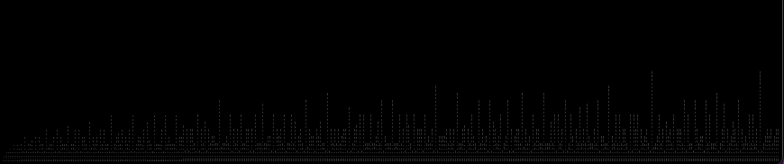
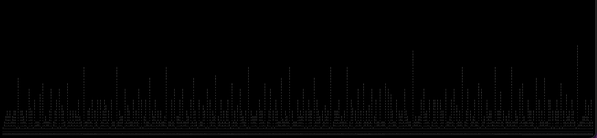
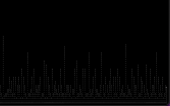

# Factors

I was curious if I can come up with a short program to come up with all the possible factors for a certain number. 
Turns out it's pretty easy.
I also wanted to write it as fast as possible. This took about 5 minutes, with optimization and minor fixes going to 10 minutes.

I was curious to see how the number of factors changed along the number line. so I created factor as a separate function. I also displayed the numbers in a way so that each number, no matter how many digits it has, takes up the same space.

I then "graphed" the results:

This image shows the pattern from 1 to 100

The images below show the pattern from 1 to 1000:

