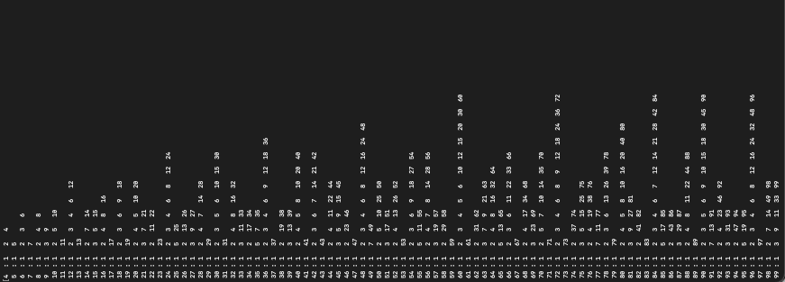
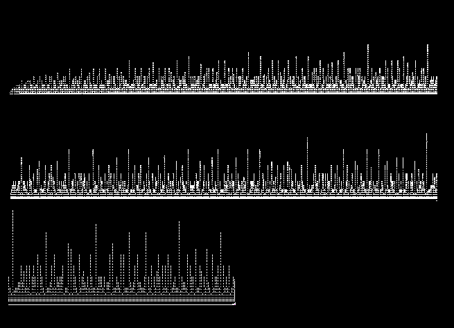

# Factors

I was curious if I can come up with a short program to come up with all the possible factors for a certain number. 

I was interested in seeing how the number of factors changes as you move up the number line. To do this, I created factor as a separate function. I also displayed the numbers in a way so that each number, no matter how many digits it has, takes up the same space in order to create an accurate graph.

I then "graphed" the results on the command line. You can click on the images for further clarity:

The images below show the pattern from 1 to 100:

The images below show the pattern from 1 to 1000:

The pattern that I deduced was no pattern. The factors seem to increase as you move up the number line, however the clustering is random. The number 480 also has more factors than any number from 1 to a 1000.
